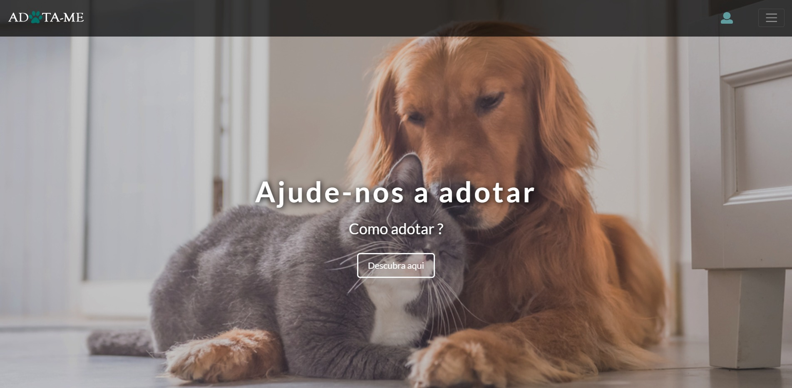

# Projeto: Adota-me

IDENTIFICAÇÃO:

O projeto "ADOTA-ME" tem como objetivo ser uma plataforma simples e intuitiva para que o utilizador possa visualizar imagens e algumas características dos animais disponíveis para adotar próximos da sua área da sua residência. Assim, facilita o contacto com o abrigo onde este se encontra e, consequentemente, o processo de adoção.

# Pré-requisitos

# Tutoriais

Abaixo estão listados alguns tutorias utilizados para criar este código:

[HTML](https://www.w3schools.com/html/)
  
[TABELA DE CORES](https://www.flextool.com.br/tabela_cores.html)

[CSS](https://www.w3schools.com/css/default.asp)

[PHP](https://www.w3schools.com/php/default.asp)

[JAVASCRIPT](https://www.w3schools.com/js/)

[BOOTSTRAP](https://www.w3schools.com/bootstrap4/)

# Tarefas 

- [X] Fazer upload do arquivo "scripts"
- [X] Fazer upload do arquivo "styles"
- [X] Fazer upload do arquivo "imagens"
- [ ] Testar funcionalidades
- [ ] Preeencher Readme 
- [X] Preencher Releases

# Histórico de Releases

- 1.0
  - ALTERAÇÕES: Versão final do site 

# Autoria
- Irene Canelas : @ccxirene
- Layla Reis : @reislayla
- Márcia Ferreira : @marciandreia11
- Sara Rocha : sararocha25

# Agradecimentos
Um agradecimento ao Professor João Paredes por todas as instruções referentes à criação da página web, bem como por todas as aulas fornecidas ao longo da cadeira de Desenvolvimento de Aplicações e Interfaces Gráficas, assim como à docente Alina Trifene por ter disponibilizado uma oportunidade de acréscimo de conhecimento e experiência ao nível de trabalho com o GitHub.

